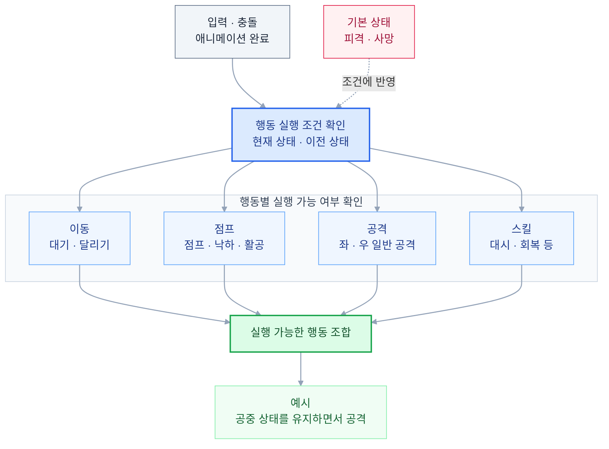

# 할로우 나이트: 실크송 모작 — C++ · WinAPI 개인 프로젝트
![[<./README THUMBNAIL - WINAPI INDIV.png>]]
2D 메트로배니아 액션 게임 **Hollow Knight: Silksong**을 **C++와 WinAPI로 모작한 개인 프로젝트**입니다. 
**게임 프레임워크**부터 **플레이어** 조작, **충돌 로직** · **전투**, **몬스터/보스 AI**, **Map · Scene 관리**와 **UI**까지 구현했습니다.

[**GitHub Repository**](https://github.com/Nu-LungJi/WINAPI-Personal-Project)
[**게임 시연 영상**](https://youtu.be/iog-P96g6nk)

| 항목     | 내용                                |
| ------ | --------------------------------- |
| 개발 기간  | 2025.11.22 ~ 2025.12.15 (3주)      |
| 개발 인원  | 1인 — 전체 프로그래밍 담당                  |
| 플랫폼    | Windows PC                        |
| 플레이 구성 | 마을 → 던전 → 게이트 → 보스전               |
| 사용 기술  | C++ · Win32 API · GDI/GDI+ · FMOD |

## 주요 기술 구현

| 번호  | 기술               | 핵심 구현                                    |
| --- | ---------------- | ---------------------------------------- |
| **1**   | **객체지향 프레임워크·게임 루프** | 공통 객체 인터페이스, 객체 생명주기 관리, 씬 전환과 상태 유지     |
| **2**   | **플레이어 FSM**         | 행동 영역 분리, 점프·공격 등 동시 행동 조합, 상태 전환 처리     |
| **3**   | **보스·몬스터 AI**        | 체력별 페이즈 전환, 확률 기반 공격 선택, 연속 공격과 기본 공격 처리 |
| **4**   | **AABB 충돌 처리**       | 충돌 방향·보정량 계산, 공격 히트박스 분리, 중복 타격 제어       |
| **5**   | **카메라 효과**           | 플레이어 추적, 씬별 이동 경계, 화면 구도 전환과 카메라 흔들림     |
| **6**   | **인벤토리·상점·대화·상태 UI** | 체력·재화 표시, 아이템 교환, 구매 처리, 대화 UI 연동        |
| **7**   | **상호작용**             | 거리·접촉·입력에 따른 NPC 대화, 상점 이용, 포탈·승강기 씬 전환  |

### 1. 객체지향 프레임워크와 게임 루프

`GameManager`를 중심으로 **객체 갱신(Update) → 후처리(LateUpdate) → 렌더링(Render)** 흐름을 구성하고, 객체 Update 이후 충돌을 처리합니다. 플레이어·몬스터·보스·UI는 `GameObject`의 초기화·갱신·렌더링·충돌 처리·해제 인터페이스를 통해 관리합니다.

- **ObjectManager :** 객체를 태그별로 분류해 Update·Render 후, Update 결과가 `OBJ_DEAD`인 객체를 ObjectManager 목록에서 제거/메모리 해제(Release)하여 생명주기를 관리했습니다.
- **SceneManager :** 이전 씬을 Release한 뒤 다음 씬을 Initialize합니다. 마을·던전 이동에서는 Scene 변경에 따라 기존의 Player나 Inventory등의 상태를 재사용하여, 이전 씬의 데이터를 그대로 전달받도록 만들었습니다. 
- **생성 과정 공통화:** 객체 생성 시 초기화와 위치·크기 설정을 공통 생성 함수로 묶었습니다.

관련 코드: [GameManager.cpp](https://github.com/Nu-LungJi/WINAPI-Personal-Project/blob/main/HollowKnight%20Silksong/GameManager.cpp) · [ObjectManager.cpp](https://github.com/Nu-LungJi/WINAPI-Personal-Project/blob/main/HollowKnight%20Silksong/ObjectManager.cpp) · [SceneManager.cpp](https://github.com/Nu-LungJi/WINAPI-Personal-Project/blob/main/HollowKnight%20Silksong/SceneManager.cpp)

### 2. Player의 행동 영역별 FSM

점프 중 공격처럼 함께 실행되는 행동을 표현하기 위해 **이동·점프·공격·스킬·기본 상태를 분리**했습니다. 각 영역의 현재·이전 상태를 Player가 저장하고, 입력·충돌·애니메이션 완료 조건에 따라 상태를 전환합니다. 아래 그래프를 통해 상태 영역을 구분하고, 어떻게 조합되는지 구체화시킨 FSM 그래프입니다.

- **페이즈 전환:** 체력 구간에 따라 기절·분노 상태로 전환합니다. 진행 단계를 기록해 같은 구간의 반복 진입을 제어합니다.
- **패턴 선택:** 난수 구간을 나누어 대시·찌르기·회전·베기·패링·공중 베기의 선택 확률을 다르게 설정했습니다.
- **연속 공격:** 애니메이션 완료를 조건으로 공중 베기의 준비 → 실행 → 후딜레이 → 재공격을 연결합니다. 준비 시점에서 플레이어 위치를 저장하여 공격 목표 위치로 사용하게 만들었습니다.

일반 몬스터는 기절/분노를 제외하고, 여러 공격 패턴 대신 기본 공격으로 구성하여 전투를 하도록 만들었습니다.

관련 코드: [Boss.cpp](https://github.com/Nu-LungJi/WINAPI-Personal-Project/blob/main/HollowKnight%20Silksong/Boss.cpp) · [Monster.cpp](https://github.com/Nu-LungJi/WINAPI-Personal-Project/blob/main/HollowKnight%20Silksong/Monster.cpp)

### 4. AABB 충돌 처리

`CollisionManager`에서 **AABB 충돌을 검사하고, 겹침이 작은 축을 기준으로 충돌 방향과 보정량을 계산**합니다. `Collision_Update()`에 충돌 상대·방향·보정량을 전달하고, 각 객체에서 지형 충돌과 전투 반응을 처리합니다.

- **지형 충돌:** 지형 이미지와 충돌 영역을 분리했습니다. 충돌 시 겹침 보정량으로 위치를 수정하고, 착지 시 점프 횟수와 공중 상태를 갱신합니다.
- **공격 판정 분리:** 캐릭터 본체와 별도의 `HitBoxObject`에 공격별 위치·크기·대미지를 설정합니다.
- **공격 유효 구간:** 몬스터·보스의 특정 스프라이트 프레임 구간에 맞춰 공격 판정을 배치합니다.
- **중복 타격 제어:** HitBox의 활성·이전 타격 플래그와 몬스터의 피격 플래그로 중복 타격을 제어합니다.
- **피격 반응:** 피격 무적과 방향별 넉백을 적용하고, 애니메이션 프레임 전환 간격을 조절해 HitStop을 연출해 보았습니다.

관련 코드: [CollisionManager.cpp](https://github.com/Nu-LungJi/WINAPI-Personal-Project/blob/main/HollowKnight%20Silksong/CollisionManager.cpp) · [HitBox.cpp](https://github.com/Nu-LungJi/WINAPI-Personal-Project/blob/main/HollowKnight%20Silksong/HitBox.cpp)

### 5. 카메라 효과

플레이어를 추적 대상으로 설정하고, **월드 좌표에서 카메라 오프셋을 빼 화면 좌표로 변환**합니다. Scene별 경계와 상황별 오프셋을 적용해 탐험·상점·전투의 화면 구도를 구성했습니다.

- **이동 범위 제한:** 마을·던전·게이트·보스전마다 카메라 경계를 다르게 적용합니다.
- **상점 구도 전환:** 상점에서는 별도의 오프셋으로 화면 구도를 이동합니다.
- **Camera Shake :** 지정 시간 동안 카메라 중심에서 Random Offset을 더하여, 피격과 보스 분노 연출에 연결했습니다.
- **화면 구성:** 배경 > GameObject(보스, 플레이어 등) > 전면 배경 > UI 순서로 렌더링해 캐릭터 앞/뒤의 지형과 장식을 두어, 맵을 구성했습니다.

관련 코드: [CameraManager.cpp](https://github.com/Nu-LungJi/WINAPI-Personal-Project/blob/main/HollowKnight%20Silksong/CameraManager.cpp) · [MapManager.cpp](https://github.com/Nu-LungJi/WINAPI-Personal-Project/blob/main/HollowKnight%20Silksong/MapManager.cpp)

### 6. 인벤토리·상점·대화 UI와 게임 상태 UI

플레이어 데이터와 UI를 연결해 **상태 표시·아이템 교환·구매 결과가 화면에 반영**되도록 구성했습니다.

| UI         | 구현 내용                                        |
| ---------- | -------------------------------------------- |
| **게임 상태**  | 체력·실크·재화 표시, 체력 감소와 구매 후 재화 차감 연출(텍스트 애니메이션) |
| **인벤토리**   | 페이지 전환, 수량·선택 표시, 장착 슬롯의 아이템 교환              |
| **상점 NPC** | 상품 선택, 잔액 검사, 구매 확인, 재화 차감과 인벤토리 등록          |
| **NPC 대화** | NPC·보스 대화 표시, 대화창의 정방향·역방향 애니메이션과 효과음        |

아이템 교환 시 슬롯과 아이템의 타입을 검사하고, **교체 애니메이션을 수행**합니다. **애니메이션이 끝나는 시점에 아이템 데이터를 교환**합니다. UI의 선택·확인 입력을 실제 게임 데이터 변경과 연결했습니다.

관련 코드: [MainUI.cpp](https://github.com/Nu-LungJi/WINAPI-Personal-Project/blob/main/HollowKnight%20Silksong/MainUI.cpp) · [Inventory.cpp](https://github.com/Nu-LungJi/WINAPI-Personal-Project/blob/main/HollowKnight%20Silksong/Inventory.cpp) · [StoreUI.cpp](https://github.com/Nu-LungJi/WINAPI-Personal-Project/blob/main/HollowKnight%20Silksong/StoreUI.cpp)

### 7. 상호작용

**거리·접촉·입력 조건을 대화와 씬 전환에 연결**해 마을에서 보스전까지 이어지는 플레이 흐름을 구성했습니다.

- **NPC + 상점:** NPC와의 거리 조건을 상점/대화 활성화 여부를 결정하도록 만들고, 상호작용 입력으로 대화 단계를 진행했습니다.
- **포탈 · 승강기:** 포탈 접촉과 게이트 승강기 연출을 다음 씬으로 연결하고, 전환 사이에 로딩 애니메이션을 표시했습니다.
- **보스전 진행:** 등장 연출을 전투 시작에 연결하고, 체력 소진 후 사망 연출과 격파 후 대화로 이어지도록 구성했습니다.
- **입력 상태 관리:** 이전 키 상태와 비교해 누름·유지·뗌을 구분하고, 창 포커스를 잃으면 입력 상태를 정리합니다.

관련 코드: [KeyManager.cpp](https://github.com/Nu-LungJi/WINAPI-Personal-Project/blob/main/HollowKnight%20Silksong/KeyManager.cpp) · [SceneManager.cpp](https://github.com/Nu-LungJi/WINAPI-Personal-Project/blob/main/HollowKnight%20Silksong/SceneManager.cpp)

## 원작 및 리소스

원작은 Team Cherry의 [Hollow Knight: Silksong](https://store.steampowered.com/app/1030300/Hollow_Knight_Silksong/)입니다. 본 프로젝트는 학습·포트폴리오용 모작이며, 원작 리소스와 외부 라이브러리의 권리는 각 권리자에게 있습니다.
